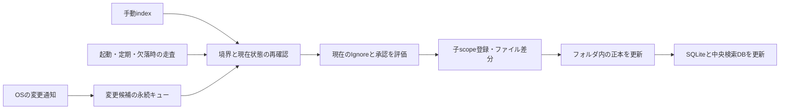

# 12 Change Detection — v1 design direction

本書の設計方針は 2026-09-07 に承認済みであり、実装済みの契約ではない。
詳細な実装契約を固定する工程は [v1-implementation-plan.md](../tasks/v1-implementation-plan.md) を参照する。
製品の到達要求は [11-product-requirements.md](11-product-requirements.md) を参照する。

## 1. 方針

登録ルートを OS の変更通知で監視し、変更候補となったディレクトリとファイルだけを再確認する。
イベント、手動 `index`、起動時・定期・障害復旧時の走査は、同じ reconciliation engine に入力する。
ignore されない新規フォルダは空でも `.kio` を持つ独立 scope とする。ルート登録時の権限は、
このローカル管理範囲を継続して管理する権限として明示する。外部送信承認は別に扱う。

イベントは「再確認すべき場所」の情報であり、ファイルの正本、変更内容そのもの、操作の許可証ではない。
変更通知一件ごとにコミットしたり、LLM を呼び出したりしない。重複通知をまとめ、現在の安定した内容を
確定してから、ローカル保存、必要な派生物の生成、承認済みの外部処理を順に行う。

## 2. 各 OS の使い分け

| OS | 基本となる通知 | 復旧上の注意 |
|---|---|---|
| macOS | FSEvents。必要な粒度に合わせて file events を利用 | 通知の集約や `MustScanSubDirs` では対象 subtree を再走査する。drop 発生時は監視対象を再照合し、保存した event ID を無条件に信用しない |
| Linux | inotify。既存の対象ディレクトリごとに watch を登録 | 再帰監視はアプリ側で構成する。新規・移入ディレクトリは watch 登録と直後の走査が必要。`IN_Q_OVERFLOW`、watch 上限、停止中の欠落は再走査で復旧する |
| Windows | `ReadDirectoryChangesW` の subtree 監視 | バッファ欠落、戻り値の byte count が 0、`ERROR_NOTIFY_ENUM_DIR` では再列挙する。NTFS USN Journal は利用可能な場合の再開最適化に限定する |

Apple はイベントとディレクトリ階層のメタデータ snapshot の併用を説明している。
FSEvents の履歴は再開に役立つが、欠落時の再走査を省く根拠にはならない。
[Apple FSEvents](https://developer.apple.com/library/archive/documentation/Darwin/Conceptual/FSEvents_ProgGuide/UsingtheFSEventsFramework/UsingtheFSEventsFramework.html)

inotify は非再帰で、rename の対が常に隣接するとは限らず、新しい watch の登録前に変更が起こり得る。
通知の件数をファイル更新回数やコミット履歴として解釈しない。
[Linux inotify](https://www.man7.org/linux/man-pages/man7/inotify.7.html)

Windows の通知欠落時には subtree の列挙が必要になる。USN は NTFS volume の変更理由を記録するが、
ファイルの過去の内容を保存する履歴ではなく、削除・再作成された journal を継続扱いできない。
[ReadDirectoryChangesW](https://learn.microsoft.com/en-us/windows/win32/api/winbase/nf-winbase-readdirectorychangesw)、
[Change Journal Records](https://learn.microsoft.com/en-us/windows/win32/fileio/change-journal-records)、
[Journal lifecycle](https://learn.microsoft.com/en-us/windows/win32/fileio/creating-modifying-and-deleting-a-change-journal)

永続 cursor は volume identity、journal identity、root identity と組にする。Linux の inotify watch ID は
永続 cursor として保存しない。OS 共通 API はイベントだけでなく、`rescan_required`、監視範囲、
継続性、backend failure を表現する。ネットワーク共有や仮想ファイルシステムでは、通知能力を検出して
polling に切り替え、低下した検知能力と最終照合時刻を利用者に表示する。

## 3. サイズ・更新日時・更新履歴の位置付け

- ディレクトリ自身のサイズは、配下のファイル容量の合計や subtree fingerprint ではない。
  フォルダの更新日時だけで、その下にある既存ファイルの内容変更を検知できるとは限らない。
- ファイルの identity、size、mtime、利用できる ctime/change information は高速な差分候補抽出に使う。
  同一サイズへの上書き、mtime の保存、時計粒度、ID の再利用を考慮し、一致を内容同一の証明にしない。
- 内容が変わったかの最終確認には、安定した読み取りで得た bytes の content hash を使う。
  読み取り前後で identity・metadata が変わった場合は再試行し、混在した内容を snapshot に採用しない。
- Kio が保持する subtree 集計サイズや Merkle digest は有用な派生情報だが、子の変更が漏れた場合には
  同じく古い値になる。OS に常時維持された完全な subtree digest が存在する前提にはしない。

ファイルサイズと時刻のフィールドは OS のメタデータであり、内容 hash と別の意味を持つ。
[POSIX stat fields](https://www.man7.org/linux/man-pages/man0/sys_stat.h.0p.html)

2026-09-07 に macOS の使い捨て一時フォルダで、既存ファイルを同サイズに書き換え mtime を維持したところ、
root/child directory の size・mtime と file の size・mtime は一致したまま、SHA-256 だけが変化した。
これはメタデータ比較の限界を示す局所実験であり、Kio や 3 OS の受入試験ではない。

通常はイベント候補に絞って hash を再計算する。通知継続性を失った場合は安全に再走査する。
metadata が完全一致していても内容が変わるケースまで回復を保証するには、必要な範囲の再 hash が必要である。
周期的な整合性確認は負荷を分散できるが、metadata-only 走査で完全性を保証したとは表示しない。

OS の更新履歴は「何かが変わった」情報であり、Kio の immutable commit 履歴の代わりにはならない。
短時間に作成後削除され、一度も安定状態として取り込めなかったファイルまで保存する保証は別要件である。

## 4. 取りこぼさない処理順序

1. root identity と管理許可を確認し、watch を開始して通知をキューに入れる。
2. 初回または復旧走査で inventory を作り、watch 開始後に蓄積した通知を再照合する。
   Linux では各ディレクトリの watch 登録後にも内容を確認し、登録前後の race を吸収する。
3. 通知の path はヒントとして扱う。保持した directory handle と現在の filesystem identity で対象を開き直し、
   root 外移動、symlink/reparse point、mount 境界、ignore を検証する。
4. 変更候補を scope 単位で統合する。rename の対が不足した場合も、旧親・新親の現在状態から復旧する。
   debounce に加えて最大待機時間を設け、書き込みが続くファイルは不安定として再試行する。
5. `.kio` 正本の更新と派生処理の再実行を冪等にする。処理済み cursor は再処理に必要な intent を永続化してから進め、
   crash 時に未処理イベントを失わない。異なる DB/ファイルの更新を一つの transaction と称さない。
6. 起動、監視再接続、sleep 復帰後の継続性不明、overflow、権限変更、root 移動、定期照合で欠落を回復する。

通知キュー・cursor・inventory は device 側の再構築可能な運用状態とする。消失時は `.kio` と実ファイルから
再照合できなければならない。承認などの正本をこの cache だけに置かない。

## 5. スコープと送信承認

子 scope の自動作成は root の明示的なローカル管理許可を継承できる。新規子への外部送信を自動的に許可するかは
独立の egress policy である。既定では自動付与しない。将来、配下への送信許可を導入するなら、適用範囲、
provider/profile、将来作成される子への適用、失効を利用者に明示した別の承認とする。

Ignore の変更は既存子にも適用する。新規発見を止めるだけでは不十分であり、検索の可視性、保留タスク、
送信直前の再検証を同じ現行 policy に結び付ける。parent policy の世代と child の適用世代を照合し、
失効を先に公開してから非同期に projection を更新する。これにより失効処理中の古い許可の使用を防ぐ。
移動・切断で policy の出所を検証できない場合は、少なくとも外部送信を停止し、明示的な再登録で解決する。

通常の知識走査とイベント対象から `.kio` の生成物を除外する一方、`.kioignore`、policy/config/consent の変更は
専用の制御通知として監視する。自分自身の DB 書き込みを契機に無限再実行しないよう、制御対象と生成物を区別する。
時刻だけで一括して通知を捨てる方法は、同時に起きた利用者の変更まで落とすため採用しない。

symlink/junction と未登録の mount 境界を既定で越えない。別 volume を対象とする場合は root として明示登録する。
Unix の device ID だけでは同一 filesystem の bind mount を区別できないので、各 OS の mount 情報も必要になる。
Windows の通知 API の実装だけでは、安全に `.kio` を作る retained-handle mutation の未対応は解消しない。

## 6. v1 の検証と残る決定

3 OS で、空フォルダ、新規・変更・削除・rename・移入、深い subtree、同サイズ上書き、mtime 保存、Ignore の
追加・解除、既存子の失効、root 移動、監視 overflow、watch 上限、停止・再起動、処理途中 crash を検証する。
自動処理と手動 `index` が同じ最終状態に収束し、承認なしの外部通信が発生しないことを確認する。
OS 固有 integration test と、通知の欠落・重複を注入する共通 engine test の両方が必要である。

v1 には CLI から起動・停止・状態確認できる継続プロセスが必要になる。OS の通知自体が `.kio` を作るわけではない。
foreground の watch 実行を最小形とし、ログインユーザーの service としての起動方法を各 OS で定義する。
管理者常駐プロセスを前提にしない。具体的な CLI 名、debounce/最大遅延、整合性確認周期、対応 filesystem は
受入試験と運用負荷を踏まえて確定する。これらの数値・API 選定は本書では既決扱いしない。
