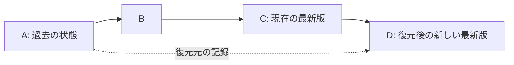

# 13 Linear History and Restore — design direction and current status

本書の線形履歴・復元の設計方針は 2026-09-07 に承認済みである。
現在の実装は storage format `3.0.0`、必須の単一 `parent`、唯一の可変参照 `HEAD`、条件付き公開 journal を使う。
2.0.0で導入した恒久的な `.kio/.store-gate` を維持し、3.0.0ではtag名のUnicode identityを是正する。
保存形式は製品v2/v3やCargo/release versionとは独立する。旧storeは書き換えず拒否し、移行機能は提供しない。
旧 `parents` 配列と旧 format の移行・read/write 互換経路は置かない。別出力先への `export` と
管理対象への `restore` は分離され、作業ファイルを含む journal 付き復元、preview、明示 recovery は実装済みである。
以下の当初の設計理由・将来案と現行契約は区別し、CLI の詳細は [06-cli-spec.md](06-cli-spec.md) を正本とする。
実装・試験の状況は [進捗記録](../tasks/v1-implementation-progress.md)、最終 3 OS 受入と次の改善は
[実装計画](../tasks/knowledge-ux-implementation-plan-2026-10-03.md) を参照する。

## 1. 過去の状態を新しい commit として採用する



D の唯一の親は C である。A は復元元の provenance として記録し、第二の親にしない。
HEAD を A に戻したり B/C を消したりしない。D の後も E、F と一本の履歴を継続する。
この構造はフォルダ全体の状態復元と、選択ファイルの復元の両方で使える。

| 操作 | D の内容 | 他のファイル |
|---|---|---|
| scope の状態復元 (`--path` 省略) | 現行 policy が許す A の raw ファイルを採用する。C にだけ存在するファイルは既定で削除しない | 明示した `--delete-missing` 以外は維持。子 scope は対象外 |
| 選択パスの状態復元 | C を基礎に、明示したパスだけを A の内容に置き換える | 選択していないパスは維持 |
| commit の差分の打消し | 指定 commit の変更を逆適用する | 後続の変更との競合処理が必要。状態復元とは別の操作 |

PDF・画像・Office を主に扱う Kio では、状態復元の結果を説明しやすい。
Git の `revert` は変更の逆適用を新 commit にする操作であり、過去 snapshot の採用と同一ではない。
CLI を `revert` と呼ぶならこの違いを曖昧にしない。
[Git revert](https://git-scm.com/docs/git-revert)、[Git restore](https://git-scm.com/docs/git-restore)

## 2. 現行 CLI

過去の原本を別場所へ書き出す操作は `export`、管理中の状態を過去版から新しい子 commit として
採用する操作は `restore` である。詳細な引数・拒否条件は [06-cli-spec.md §5](06-cli-spec.md) に従う。

```text
kio export <commit> --to <directory>
kio restore <source> --preview
kio restore <source> --path report.pdf --path notes.md --preview
kio restore <source> --path report.pdf --expected-head <current-commit> --message "restore report"
kio restore <source> --delete-missing obsolete.md
kio repair recover-restore
```

`source` は `HEAD`、full commit hash、tag を受け付ける。`--path` 省略時は source tree のうち
現在の管理・ignore policy が許す path を戻す。source に存在しない current-only file は自動削除せず、
削除対象は `--delete-missing` で明示する。preview は読み取り専用で、適用時は HEAD と対象の
working bytes・identity を再検証する。`--expected-head` は preview 時の HEAD を適用時に固定できる。

管理中の未保存変更や未管理ファイルを黙って上書きしない。現在と同じ内容を選んだ場合は no-op とする。

## 3. 線形形式の不変条件

- genesis の parent はなし。それ以降の公開 commit は親が一つで、公開時に観測した current HEAD と等しい。
  現行 schema は単一 `parent` を表す。
- 可変の current HEAD は一つの正本であり、branch は持たない。
- tag は一本の chain 上の commit を指す論理名である。2026-10-03の開発版で
  `tag --delete` と削除後の同名再作成を接続した。削除はrefだけを解除し、HEAD・CASと名前の監査行を保持する。
  切断した別履歴を新しい公開 root として認めない。タグ作成・取り込んだタグの読取・台帳由来の
  rebuild root は、現在の HEAD から parent を逆にたどって到達できることを検証する。
  未公開の子 commit と unborn HEAD に残ったタグも拒否し、タグから HEAD を推測して復旧しない。
  shallow 化済みの版に後から tag を付けて元 bytes を回復することはできない。
- 復元 commit は `restored` の typed metadata に復元元と選択パス等の provenance を記録し、
  現在の HEAD を唯一の親にする。復元元は同 scope の過去に限定する。
- 「親としてたどる辺」と「監査のための参照」を区別する。復元元への参照を無期限の GC pin とすると
  purge/retention を壊す。復元 provenance は元の引用を保持する pin ではない。
  HEAD/tag の tip は retention GC の shallow 候補外だが、明示的な purge/erase を防がない。
- 旧 DAG 形式は version を区別して明示的に reject する。旧形式の reader や互換 alias は要件にしない。
  ただし旧 `.kio` や利用者ファイルを自動削除しない。必要な知識の export/import は明示操作として扱う。

## 4. 復元 transaction

複数の普通のファイルを別々に置換する操作は、他アプリから見て一斉に切り替わる filesystem transaction
ではない。現行実装は journal と段階的な検証で中断回復を行う。以下は復元時の主要な不変条件であり、
操作 ID を一覧する履歴 UI や永続的な操作ログの提供まで実装済みとみなさない。

1. current HEAD、source closure、raw bytes の存在と hash、purge 状態、現在の policy、
   変更・削除・衝突予定を検証する。scope 直下の管理対象だけを plan に固定する。
2. scope lock 下で HEAD と対象 identity を再検証し、before/after と進行段階、
   復旧に必要な情報を journal に永続化する。新しい tree/commit を耐久化してから公開する。
3. 同一 filesystem の stage と journal を使い、no-follow/handle-bound な置換・削除を行う。
   Kio の読み手は適用中の scope を除外または busy と表示し、古い検索結果を最新版として提供しない。
4. 唯一の HEAD を expected-value 付きで公開する。復元済み原本と検索 projection の状態を分けて報告し、
   projection 再構築が失敗した場合も復元済み HEAD を巻き戻さず、検索の利用不可を明示する。
   adapter や外部送信を伴う再処理を暗黙に開始しない。
5. crash 復旧は `kio repair recover-restore` が journal と現行 HEAD を照合して判断する。
   journal が残る間は通常操作を拒否し、途中までの bytes から復元完了と推測しない。

過去の raw 内容を採用しても、現在の ignore、送信承認、tool 設定、予算、課金台帳、保留タスクを巻き戻さない。
旧 Markdown/embedding は raw identity と現行 profile の互換性を検証できるときだけ再利用する。
不適合な派生物は再生成対象にし、外部処理はその時点の承認を必要とする。purged/shallow な元データが
欠ける場合は理由付きで拒否し、履歴復元を暗黙の resurrection にしない。

## 5. フォルダ配下全体と v3

一つの `.kio` はそのフォルダの直下を管理する。親の「全体復元」は子 scope の過去を決めない。
配下全体の復元を提供する場合は、scope ごとの current HEAD と復元元を固定した coordinator plan が必要になる。
親 commit 時刻から子の版を勝手に推測せず、必要なら root checkpoint に scope→commit 対応を保存する。
別 volume をまたぐ全体 atomicity は保証せず、scope ごとの成功・失敗・未適用と再開方法を示す。

v3 でも canonical history を一本に保つことは可能である。サーバーで expected HEAD を比較し、古い状態からの
同時更新には競合解決を要求する。共同編集で CRDT 等を採用しても、その編集状態を確定して一つの子 commit を
発行できる。これは将来の設計選択であり、今から多親 commit を必要とする理由ではない。

共有時は tenant/principal、scope identity、current policy の境界を追加する。同じ content hash を同じ権限の
証拠にせず、復元・検索・replication のすべてで所属と可視性を確認する。共有された `.kio` の承認記録だけで
受信側端末の外部送信許可を成立させない。

## 6. 導入順序

線形 schema・単一 HEAD・policy と履歴の分離、および CLI の管理対象 restore は実装済みである。
まず現行候補のローカル検証と同一 SHA の 3 OS 受入を完了する。続いて既存 tag を利用した
「重要な版を保持する」導線、GC・tag 解除・purge の影響表示、原本復元と検索準備状態の区別を改善する。
引用自体は可変の tag 名ではなく不変の Evidence Pointer に固定する。引用群の保持、持ち出し bundle、
操作 ID を追える利用者向け履歴は追加設計として [実装計画](../tasks/knowledge-ux-implementation-plan-2026-10-03.md)
で扱う。v2 の GUI は export と管理中の状態復元を区別して表示し、CLI と同じ plan・競合・復旧結果を利用する。

検証には、複数親/別 head の拒否、current-only file の既定保持と明示削除、選択復元の非選択パス保持、未保存変更、元にないパス、
purge、derived-state 不整合、policy 非復活、HEAD 競合、各 stage での crash を含める。
