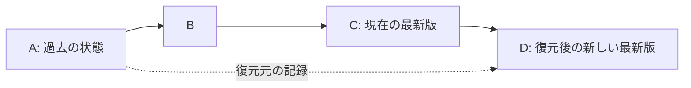

# 13 Linear History and Restore — design direction

本書の線形履歴・復元の設計方針は 2026-09-07 に承認済みである。
現在の実装は storage format `2.0.0`、必須の単一 `parent`、唯一の可変参照 `HEAD`、条件付き公開 journal へ移行している。
2.0.0 は恒久的な `.kio/.store-gate` による concurrency protocol を必須にする保存形式の変更であり、製品 v2 (GUI) や Cargo/release version とは独立する。
旧 `parents` 配列と旧 format の移行・read/write 互換経路は置かない。CLI の管理対象への `restore` と別出力先への `export` の分離、
作業ファイルを含む復元 transaction は未実装であり、線形保存形式の実装と区別する。
実装・試験の状況は [進捗記録](../tasks/v1-implementation-progress.md)、受入条件は
[v1 実装計画](../tasks/v1-implementation-plan.md) を参照する。

## 1. 過去の状態を新しい commit として採用する



D の唯一の親は C である。A は復元元の provenance として記録し、第二の親にしない。
HEAD を A に戻したり B/C を消したりしない。D の後も E、F と一本の履歴を継続する。
この構造はフォルダ全体の状態復元と、選択ファイルの復元の両方で使える。

| 操作 | D の内容 | 他のファイル |
|---|---|---|
| scope 全体の状態復元 | A の管理対象の raw ファイル集合と内容を採用する。C にだけ存在する管理対象は削除予定に含む | 直下の管理対象全体を変更し得る。子 scope や未管理ファイルは別扱い |
| 選択パスの状態復元 | C を基礎に、明示したパスだけを A の内容に置き換える | 選択していないパスは維持 |
| commit の差分の打消し | 指定 commit の変更を逆適用する | 後続の変更との競合処理が必要。状態復元とは別の操作 |

PDF・画像・Office を主に扱う Kio では、前二者を先に実装する方が結果を説明しやすい。
Git の `revert` は変更の逆適用を新 commit にする操作であり、過去 snapshot の採用と同一ではない。
CLI を `revert` と呼ぶならこの違いを曖昧にしない。
[Git revert](https://git-scm.com/docs/git-revert)、[Git restore](https://git-scm.com/docs/git-restore)

## 2. CLI 案

現行 `restore <source> --to <path>` は別場所への書き出し専用である。
`crates/kio-cli/src/restore.rs:650-674` の管理領域への書き込み拒否だけを外してはならない。
HEAD、manifest、index、replica の公開処理が伴っていないためである。

互換 alias を残さず、次の意味に整理する案を推奨する。名前は実装前に CLI 全体と整合させる。

```text
kio export --from <commit> --to <directory>
kio restore --from <commit> --whole-scope --preview
kio restore --from <commit> --path report.pdf --path notes.md --preview
kio restore --from <commit> --path report.pdf --expect-head <current-commit> --yes
```

`--whole-scope` と繰り返し指定可能な `--path` は必ず排他とする。カンマ区切りは正当なファイル名と競合するため
使わない。選択パスが復元元にない場合は既定でエラーとし、削除を選べる明示的な操作を用意する。
`--yes` は表示済みの操作意図に対する非対話の確認であり、policy、競合、HEAD 検証を無効化しない。
プレビュー後に対象が変われば、`--expect-head` とファイル fingerprint を再検証して適用を拒否する。

管理中の未保存変更や未管理ファイルを黙って上書きしない。先に通常の snapshot を作るか、明示的に退避する。
現在と同じ内容を選んだ場合は no-op とし、復元理由だけを記録したい監査要件は別に設計する。

## 3. 線形形式の不変条件

- genesis の parent はなし。それ以降の公開 commit は親が一つで、公開時に観測した current HEAD と等しい。
  `parents: Vec` を実質的に制限するだけでなく、単一 `parent` を表す schema に整理する。
- 可変の current HEAD を一つの正本にする。`HEAD` と `refs/heads/main` の二重書き込みを廃止する。
  現行 `scope.rs:2380` は二つの atomic rename 間の crash 不整合を明記している。
- branch は導入しない。保持する tag は一本の chain 上の commit を指す不変の名前とし、
  切断した別履歴を新しい公開 root として認めない。タグ作成・取り込んだタグの読取・台帳由来の
  rebuild root は、現在の HEAD から parent を逆にたどって到達できることを検証する。
  未公開の子 commit と unborn HEAD に残ったタグも拒否し、タグから HEAD を推測して復旧しない。
- 復元 commit は `type=restored` 相当の typed metadata を持ち、復元元 commit/tree、選択方式、
  正規化したパス集合の digest、現在の親を immutable に結び付ける。復元元は同 scope の過去に限定する。
- 「親としてたどる辺」と「監査のための参照」を区別する。復元元への参照を無期限の GC pin とすると
  purge/retention を壊すので、provenance が残っても元 bytes が削除され得ることを定義する。
- 旧 DAG 形式は version を区別して明示的に reject する。旧形式の reader や互換 alias は要件にしない。
  ただし旧 `.kio` や利用者ファイルを自動削除しない。必要な知識の export/import は明示操作として扱う。

## 4. 復元 transaction

複数の普通のファイルを別々に置換する操作は、他アプリから見て一斉に切り替わる filesystem transaction
ではない。Kio 自身の読み手を制御し、途中停止を復旧可能にする保証を実装する。

1. current HEAD、source closure、raw bytes の存在と hash、purge 状態、現在の policy、空き領域、
   変更・削除・衝突予定を検証する。scope 直下の管理対象だけを plan に固定する。
2. scope lock 下で HEAD と対象 identity を再検証し、operation ID、before/after、進行段階、
   復旧に必要な保存先を journal に永続化する。raw CAS と新 tree/commit を先に durable にする。
3. 同一 filesystem の stage と journal を使い、no-follow/handle-bound な置換・削除を行う。
   Kio の読み手は適用中の scope を除外または busy と表示し、古い検索結果を最新版として提供しない。
4. 唯一の HEAD を expected-value 付きで公開する。source SQLite と aggregator に新しい generation を
   投影し、派生処理が残る場合は未完状態を明示する。DB 投影は正本から冪等にやり直せるようにする。
5. crash 復旧は journal の段階に従って roll-forward/rollback を判断する。途中までの bytes を偶然読んで
   復元完了と推測しない。各 durable boundary に fault injection を置く。

過去の raw 内容を採用しても、現在の ignore、送信承認、tool 設定、予算、課金台帳、保留タスクを巻き戻さない。
旧 Markdown/embedding は raw identity と現行 profile の互換性を検証できるときだけ再利用する。
不適合な派生物は再生成対象にし、外部処理はその時点の承認を必要とする。purged/shallow な元データが
欠ける場合は理由付きで拒否し、履歴復元を暗黙の resurrection にしない。

## 5. フォルダ配下全体と v3

一つの `.kio` はそのフォルダの直下を管理する。親の「全体復元」は子 scope の過去を決めない。
配下全体の復元を提供する場合は、scope ごとの current HEAD と復元元を固定した coordinator plan が必要になる。
親 commit 時刻から子の版を勝手に推測せず、必要なら root checkpoint に scope→commit 対応を保存する。
別 volume をまたぐ全体 atomicity は保証せず、scope ごとの成功・失敗・未適用と再開方法を示す。

v3 でも canonical history を一本に保つことは可能である。サーバーで expected HEAD を比較し、古い状態からの
同時更新には競合解決を要求する。共同編集で CRDT 等を採用しても、その編集状態を確定して一つの子 commit を
発行できる。これは将来の設計選択であり、今から多親 commit を必要とする理由ではない。

共有時は tenant/principal、scope identity、current policy の境界を追加する。同じ content hash を同じ権限の
証拠にせず、復元・検索・replication のすべてで所属と可視性を確認する。共有された `.kio` の承認記録だけで
受信側端末の外部送信許可を成立させない。

## 6. 導入順序

v1 の形式を固定する前に、線形 schema・単一 HEAD・policy と履歴の分離を決める。管理領域への適用機能は
CLI として共通 engine に実装し、遅くとも v2 の GUI 操作が完成する前に利用可能にする。
v2 は export と管理中の状態復元を区別して表示し、CLI と同じ plan・競合・復旧結果を利用する。

検証には、複数親/別 head の拒否、全体復元の削除、選択復元の非選択パス保持、未保存変更、元にないパス、
purge、derived-state 不整合、policy 非復活、HEAD 競合、各 stage での crash を含める。
