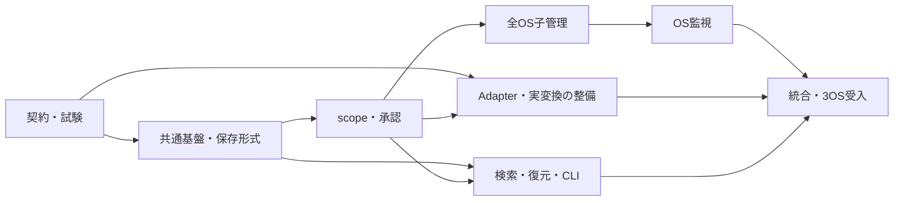

# Kio v1.0 実装計画

作成日: 2026-09-07。計画基準: `d2fe7ef`（製品コードは `1df10f2` / RC.3）。
前回の方針・調査結果は利用者が承認済み。本書は、それを実装可能な作業単位と受入条件に展開した提案である。
工程表の作業は未実施であり、計画の存在を実装完了と扱わない。

## 1. 完成範囲

- CLI の text/vector/hybrid・画像検索、履歴検索、外部送信承認、scope 境界を完成させる。
- LLM による Markdown 化、PDF/Office 前処理、外部 Adapter 接続を実データ経路で検証する。
- Ignore 外の新規フォルダを空でも自動管理する。OS 通知を主経路とし、手動・起動・欠落復旧・定期走査を共通化する。
- 知識と scope の正本は各 `.kio` に置く。scope SQLite と中央 replica は再構築可能にし、課金等の運用正本は中央に分離する。
- 保存形式は単一 parent・単一 HEAD の線形履歴へ変更する。旧形式の暗黙変換、互換 reader、旧 CLI alias は残さない。
- 本計画では単一 scope 全体と選択ファイルの「最新版への復元」も CLI に先行実装する。これは v2 を GUI 実装に集中させるための計画上の追加提案である。
- Windows、Linux、macOS の同一候補に対する Actions の機能証跡をそろえる。

GUI は v2、cloud・共同編集・複数利用者 ACL は v3。PersonaScope/personaCorpus の検索品質・性能評価は
v1 完成条件に含めない。既存の機能回帰、秘密保持、データ復旧、停止・再開の試験は維持する。
複数 scope を一括で過去へ戻す coordinator、Git 型の差分逆適用、USN による高速再開は後続拡張とし、
v1 ではその代わりに曖昧な同時復元や時刻からの版推測を提供しない。

要件: [11-product-requirements.md](../docs/11-product-requirements.md)。
変更検知: [12-change-detection.md](../docs/12-change-detection.md)。
履歴: [13-linear-history.md](../docs/13-linear-history.md)。
現状: [product-v1-readiness-2026-09-07.md](product-v1-readiness-2026-09-07.md)。

## 2. 実装を始める前に固定する契約

| 論点 | この計画の推奨仕様 |
|---|---|
| root の管理許可 | root を指定する明示操作で継続的なローカル管理を許可する。将来の子も対象にするが外部送信許可は増やさない |
| 子の継承 | 管理 root の identity、scope identity、policy 世代を結び付ける。独立登録済みの scope を黙って取り込まない |
| policy | 親からの除外・失効を子の否定ルールだけで解除できない。権限の上限と単なるファイル選別ルールを分ける |
| 中央状態 | registry、watch inventory/cursor/queue、replica は復旧可能な派生状態。根拠となる管理許可を cache にだけ置かない |
| 中央の運用正本 | 課金intent/reservation/resultは永続化順序、WAL-safe backup、復旧/照合を持つ。provider結果不明時は未解決として保持し、勝手に再送しない |
| 外部承認 | scope、Adapter、宛先、処理 profile に結び付ける。移動・コピー・profile 変更で以前の許可を暗黙に流用しない |
| ローカル接続 | HTTP loopback の場所だけを信頼しない。文書送信前に受信サービスを認証する。認証済み TLS を全 OS の共通経路とし、安全な local IPC は必要な backend に限定する |
| local trustの登録・更新 | trust anchor/pinは明示登録し、端末側の利用者専用設定に保存する。scope内容から信頼を追加せず、証明書変更を自動承認しない。更新・失効・再起動時の動作を定める |
| 通信と処理 identity | 出力再利用の profile と、宛先・credential binding・TLS peer の実行許可 identity を分離する。credential 値を hash・ログ・共有 `.kio` に埋め込まない |
| ファイル更新 | 通知は候補抽出。size/mtime 一致だけで不変と証明せず、必要な再 hash と欠落復旧を実装する |
| 履歴 | genesis 以外は parent が一つ。唯一の HEAD と journal で公開・復旧する。tag は同じ chain 内の参照 |
| 復元 | 管理対象のuser raw pathだけを新しい子 commit として採用する。`.kio`全体と`.kioignore`等の制御pathを復元入力から除外し、現在の policy、承認、課金台帳を巻き戻さない |
| 対応範囲 | 通常のローカル filesystem を 3 OS で必須検証。symlink/junction・未登録 mount 越境は拒否。通知非対応 FS は照合走査へ移行し、能力低下を表示する |

外部 LLM の v1 必須実証対象は、現在の Mistral OCR、Gemini embedding、認証済み local Adapter とする案を採る。
既存の Prepare/Markdownize/Embedding/Rerank trait を整理して provider 追加時に core の権限処理を複製しない。
任意の shell command dispatcher や汎用 plugin/MCP 実行基盤は、この接続要件の代替として追加しない。
GPT/Claude 等を「対応済み」と表示する場合は、個別 backend と実接続試験の追加を必須にする。

初期リリースの debounce・最大待機・全照合周期・対応ファイル形式・容量上限は M0 で一つの設定表に固定する。
数値は既存テスト規模と小さなローカル試験から決め、PersonaScope の完成待ちにはしない。
処理が追い付かない状態は backlog として可視化し、未走査範囲を処理済みと表示しない。

## 3. 構成と所有権

既存の crate を使い、CLI に集中している実行 orchestration を新しい `kio-app` library に移す。
コマンド群ごとに段階的に移動し、同じ処理の旧実装と新実装を恒久的に並存させない。

| 所有領域 | 責任 |
|---|---|
| `kio-core` | scope identity、filesystem capability、保存形式、単一 HEAD、履歴、公開 journal と復旧 |
| `kio-pipeline` | scan/prepare/normalize/task、content hash、再処理、ledger の実行処理 |
| `kio-adapter` | 接続契約、peer 検証、実 provider、変換プロセス、応答境界 |
| `kio-index` / `kio-search` | source/replica projection、scope と policy を含む適格性、検索・ページング |
| `kio-app`（新設） | 共通 command API、effective policy、root reconciliation、watch backend と実行調停、restore orchestration |
| `kio-cli` | 引数検証、出力、確認、終了コード。CLI 自身を起動する再帰 subprocess を自動管理の中核にしない |
| `kio-eval` / tests / workflows | 合成 fixture、受入実行、証拠の検証、配布物検証 |

依存は CLI → app → 既存 domain crate の方向にし、core/pipeline から CLI/app へ逆依存を作らない。
将来 GUI は同じ app API を使う。native watcher は app 内の OS 別 module とし、イベント通知から直接書き込まない。
同じソースを複数 worker が同時編集しない。`main.rs`、共通 schema、Cargo lock の統合責任は主担当に置く。

## 4. 工程と完了条件

| 工程 | 実装内容 | 完了を示す証拠 | 依存 |
|---|---|---|---|
| M0 契約・試験基盤 | 本計画を実行タスク化。CLI/format/policy state machine、対応表、受入ケース ID を固定。Windows handle 操作と local peer 認証の最小 feasibility 試験を先行する | 現行との差分表、fixture、既知問題の再現ケース、全要件→試験 ID の対応 | なし |
| M1 共通実行・保存形式 | app 抽出、単一 parent/HEAD、新 format、journal、GC/purge/repair/history の追随。旧形式を最初の書込み前に拒否 | 旧形式を変更しない拒否、複数親・別 head 拒否、公開各段階の crash 復旧、既存 CLI の機能回帰 | M0 |
| M2 scope と承認 | root/child 所属、現行 policy evaluator、Ignore 失効、検索・send gate、scan と egress 承認の分離 | 既存子の Ignore 追加後に検索と送信が停止。失効中の並行処理、copy/move、profile 変更、重複 scope が fail closed | M1 |
| M3 全 OS 自動管理 | 空フォルダを含む discovery、handle-bound 子作成、Windows mutation、mount/VCS/ignore、移動・削除・再登録 | 3 OS の手動 index で同じ scope 集合になる。境界外へ書かず、独立した既存 scope を奪わない | M1、M2 |
| M4 OS 監視と継続運転 | macOS/Linux/Windows backend、永続 dirty queue、初回照合、重複統合、停止・再開、欠落復旧、ユーザー単位の起動/停止/状態確認 | native event と手動 index が同じ最終状態に収束。overflow・再起動・sleep相当・write中・queue上限・自己通知で消失/無限loopなし | M3 |
| M5 Adapter と実変換 | local peer/trust lifecycle、converter の環境/実行時間/資源/通信制限、実 Mistral/Gemini・local 経路、batch・予算・取消、中央ledger復旧の統合 | 偽local peerへ本文を送らない。実Office出力、PDF/image→Markdown/embedding、実provider成功、拒否・再試行・不明結果・ledger復旧の契約試験 | M0 から並行準備、M2 後に統合 |
| M6 検索・復元・CLI 仕上げ | replica の世代とpolicy、再構築、画像/履歴検索、全体/選択restore、read-only preview、selector排他、budget月境界 | DB再構築前後の結果同値、復元は唯一の子、未選択/未管理ファイル保持、現行権限非復活、全CLI help/JSON/終了コード整合 | M1、M2。最終統合は M4、M5 |
| M7 v1受入・候補確定 | fresh環境→実配布binary→一連の利用、native3OS Actions、security差分再検証、運用文書とpackaging | 同じ候補SHAに結び付いた全必須receiptがpass。skip/環境未準備をpassにしない。既知の必須機能欠落・未解決security問題なし | M1〜M6 |

主な依存関係:



M5 の fixture・converter 検出・接続 client と M6 の履歴/restore は、担当ファイルを分けて主経路と並行する。
Windows と local peer の方式が成立するかは M0 で確認し、全実装後の受入段階までリスクを放置しない。

## 5. 特に先送りしない実装項目

### M1: 保存形式と復旧

- `parents` 配列、複数 refs、first/all-parent の分岐、snapshot writer、history reader、GC の到達可能性を一緒に更新する。
- 唯一の HEAD の更新は expected HEAD と結び付ける。CAS/manifest/SQLite/replica の複数更新を atomic と偽らず、
  journal の段階と generation で再開・読取制御する。
- schema/fixture を新形式に揃える。旧データはその場で変換・削除しない。必要な旧知識の回収は旧配布物による
  明示 export 等として手順化し、新 reader に旧形式分岐を持ち込まない。

### M2〜M4: policy と監視

- Ignore は新規発見だけでなく、既存子・孫・全scope検索・履歴検索・cursor再利用・送信直前へ適用する。
  失効を先に可視化し、projection 削除が終わるまでの窓でも旧結果や保留送信を許可しない。
- 送信開始と revoke の順序を同じ authority boundary で決める。既にproviderへ届いたデータは取り戻せないことを
  明示し、以後の新規送信を止める。watch event の到着を待たない send-time の再検証を置く。
- root overlap、nested既存scope、rename、mount交換、case/Unicode、非UTF8/長いpathの契約を統一する。
  OS差でファイルが別scopeに所属したり、勝手にscope IDが共有されたりしない。
- Watch ID や event cursor を権限として扱わない。保留作業を永続化してからcursorを進め、上限に達したら
  boundedな再走査へ落とす。未処理キューを捨ててcompleteと表示しない。
- 全 `.kio` を無条件に通知除外せず、policy/consent設定変更は制御イベントとして扱う。
- foreground実行と同じbinaryをログインユーザーの常駐起動に使う。管理者権限を必須にしない。
  ユーザーsessionを持たないCIでは通常process起動をservice試験成功と読み替えず、別のnative lifecycle試験を用意する。

### M5: 外部実行と証跡

- local HTTPへbearer tokenを付けるだけの修正は不可。偽listenerが本文とtokenを受信するため、server認証を先に完了する。
  認証済みlocal serviceであることは、そのサービス自身の外部通信禁止の証明ではない。保証範囲を表示する。
- 初回trustは利用者が指定したCA/certificate/pinを認証済みの経路または別経路の照合で登録する。接続先から得た
  self-signed certificateをその場で自動信頼しない。端末設定をowner-onlyにし、`.kio`の複製から信頼設定を継承しない。
  再起動後の既存trust、期限切れ、失効、明示的rotation、誤った証明書への変更での送信停止を試験する。
- converterは最小環境変数、private作業領域、timeout/子process終了、資源制限、不要network禁止を実装する。
  Office内部の外部参照・secret環境継承・子process残留を合成fixtureで検証する。OS固有の制限方式はM0で選定する。
- 実providerの通常経路だけでなくbatch完了・再開・画像添付・query embeddingを確認する。
  課金発生後に結果が不明な場合は自動再送で二重課金せず、既存ledgerの照合・再開契約を保つ。
- M0で既存ledgerのintent/reservation永続化→送信→provider結果記録→settlementの順序を契約化し、M5で検証する。
  provider受付後・local結果記録前に停止した場合はintent/job/request IDで照合する。照会不能なら未解決状態を保ち、
  新しい課金要求を発行しない。mock providerの受付回数で再送抑止を検証し、実providerへの障害注入を必須にしない。
  中央ledgerの整合backupからの復旧、scopeのみ復元された場合の照合、ledger消失時の課金処理停止も試験する。
- 実接続はtinyな公開可能fixtureと上限予算で行う。request/job IDはprivate証跡に保持し、credentialや本文を通常logに出さない。

### M6: 共通 CLI 契約

| 操作 | 計画上の意味 |
|---|---|
| rootの初期化/登録 | root指定によるlocal管理許可。自動管理範囲と除外をpreviewできる |
| `index` | 共通reconciliation engineの一回実行 |
| `watch` | 同じengineの継続実行、起動・停止・状態確認 |
| `adapter approve/revoke` | 永続egress許可の専用操作。local管理の許可と分ける |
| `--online` / `--offline` | 今回のremote処理を選択/禁止する。`--online`だけでは永続許可を新設しない |
| `--yes` | 指定した操作の確認を非対話化する。権限、予算、競合を無効化しない |
| `search --mode` | `auto/text/vector/hybrid`を維持。allとscope/descendantsの競合を拒否 |
| `export` | 過去内容を別ディレクトリへ書き出す |
| `restore` | 現在のHEADの子として全体または選択パスの過去状態を採用する |

コマンドの正確な引数表は M0 で [06-cli-spec.md](../docs/06-cli-spec.md) に統合する。
`index --approve` や旧 `restore --to` を互換aliasとして残さない。previewはlock file作成・修復・enrichmentを行わない。
単一scopeの全体復元は対象外/未管理ファイルを消さず、選択復元は非選択パスを変えない。dirtyな対象、source欠落、
purge済み、HEAD競合は適用前に止める。source不在パスの削除は明示的な選択とする。
復元sourceは管理対象のuser raw pathに限定する。`.kio`配下のconfig/consent/journal/index/運用情報と、直下の
`.kioignore`等の制御pathはコピーしない。新HEADや新journalは更新されても、現在の設定・承認内容とpolicy世代は維持する。

## 6. 受入マトリクス

| ID | 必須ケース | 証跡 |
|---|---|---|
| A01 | fresh user data/configでinit→index→text検索→原文確認 | 3OS、APIなしの実binary、入出力hash |
| A02 | 非Ignoreの空・深い・新規・移入フォルダ、追加/更新/削除/rename | 手動とnative watchの最終scope集合・raw hashが一致 |
| A03 | 通知drop、queue/watch上限、停止中更新、再起動、同size/mtime変更 | 再照合で回復、進捗/未処理範囲が正確 |
| A04 | Ignore変更、承認revoke、secret hold、偽local peer、trust登録/再起動/rotation/失効、scope clone/move | 検索非表示、未認証serverへの本文受信0、root外書込0。正規trustの再起動/明示更新は成功 |
| A05 | text/vector/hybrid、画像、multi-scope、履歴、paging/cursor | scope/policy/profile世代を維持した機能assertion。品質benchmarkと分離 |
| A06 | source SQLite/aggregator消失・破損、同時index/search | `.kio`から再構築、結果同値または明示した一時未完状態 |
| A07 | DOCX/PPTX→PDF、PDF/image→Markdown、XLSX、壊れた入力 | 実converter version、fixture/output hash、出力構造、拒否/timeout |
| A08 | Mistral/Gemini/local、batch/realtime、query embedding、認証/予算失敗、受付後の結果不明 | 実provider receiptとmock failure契約の両方。不明要求の重複送信0または明示未解決 |
| A09 | 全体/選択restore、削除、dirty、purged、同時HEAD変更、過去の制御path混入 | 親は旧currentの一つだけ。現在のconfig/consent内容・policy世代・ledger維持、非選択保持 |
| A10 | commit/restore/rebuild/queue/ledgerのdurable境界でprocess停止、中央backup復旧 | 再開後のHEAD・bytes・projection整合、provider受付前後の再送防止、未解決intent保持、欠落ledgerで課金停止 |
| A11 | watch常駐の登録・起動・停止・再起動・解除 | 3OSのuser-level lifecycle証跡、複数起動競合、秘密を含まないstatus |
| A12 | 配布archive、hash、SBOM/依存情報、clean install、help/version | exact候補SHAと各OS artifactの対応、展開後binaryでA01〜A11を実行 |

API返答や画像/embeddingの値は同じ要求でも変わり得るため、実provider出力のbyte一致を合格条件にしない。
出力hashは証拠として保存し、構造、参照、非空vector、次段の処理成立、使用量記録を検証する。
Office出力のmetadata差も同様に扱い、配布binaryの再現buildとprovider/rendererの出力同一性を混同しない。

## 7. ローカル検証と GitHub Actions

現行workspaceは Rust 1.98.0、edition 2024、lockfile固定である。Ubuntu CIの順序はaction reference検査の後に
fmt → clippy → test。計画ではtoolchainをローカルとCIで固定し、既存の検査を共通scriptへまとめて重複定義を減らす。

```bash
cargo +1.98.0 fmt --all -- --check
cargo +1.98.0 clippy --workspace --all-targets --locked -- -D warnings
cargo +1.98.0 test --workspace --all-targets --locked
cargo +1.98.0 build --release --locked --all-features -p kio-cli -p kio-eval --bins
```

このほか現行 [ci.yml](../.github/workflows/ci.yml) のtiny current/history生成、attestation、history replay、
crossscope、M3機能シナリオを同じ順序で再現する。既存のpersona materialization/leaseの製品に関係する機能試験は
単に「PersonaScope評価は任意」という理由で削除しない。研究用の性能・Recall受入は必須機能gateと分離する。
既存の小さな検索回帰fixtureのassertionは残せるが、外部corpusの完成をreleaseの依存にしない。

CIは次の独立した証跡を集める。

1. 通常CI: fmt/clippy/test、合成E2E、security/dependency、3OSのfilesystem/watcher/restore試験。
2. 実Office: 各OSでrendererを用意して必ず変換する。renderer不在のearly returnを成功に数えない。
3. 実provider: protectedな候補実行。環境secretと予算上限を持ち、未準備・未実行・skipはnon-passとして記録する。
4. 配布物受入: [draft-release.yml](../.github/workflows/draft-release.yml) のexact-SHA build/verify/smokeを拡張し、
   展開した配布binaryでも上記の必須機能を確認する。

OS × lane は次のように固定する。実provider試験を1 OSだけで代替しない。

| ケース/lane | Linux | macOS | Windows | 実行時期 |
|---|---|---|---|---|
| A01〜A06、A09〜A11のnative/contract | 必須 | 必須 | 必須 | 関連変更のローカル確認後、通常CIと候補受入 |
| A07の実Office | 必須 | 必須 | 必須 | converter関連変更と候補受入 |
| A08のmock障害・中央ledger | 必須 | 必須 | 必須 | 通常CIと候補受入 |
| A08の実Mistral/Gemini/authenticated local | 必須 | 必須 | 必須 | 候補確定時のprotectedな一つのmatrix workflow |
| A12の配布物 | 必須 | 必須 | 必須 | 同一SHAの配布archive生成後 |

実provider workflowは通常pushから起動せず、候補SHA、総予算、fixture/要求数上限を必須入力にする。
3 OS × provider/laneへ予算を割り当て、割当合計を総予算以下にする。各jobのlocal budgetだけに全体上限を任せない。
同じ予算枠のlive workflowを同時に複数動かさず、結果不明の要求を再送せず保留する。
必要なcredentialは保護された環境に限定し、provider側で対応する上限があれば併用する。
このmatrixと予算見積りをM0で確定し、支出承認がまだなければtiny fixture・workflow・mock検証を完成させてから確認する。

機能、OS、実行lane、commit SHA、binary hash、fixture hash、tool/profile、結果、除外理由をreceiptへ記録し、
必要なreceiptが欠けた候補はrelease-readyにしない。Windowsの`experimental`表記は実証後に`supported`へ変更する。
Linuxコンテナの成功をWindows/macOSのnative成功に代用しない。

各push前に発火workflowを確認し、再現可能なローカル失敗を解消する。Actionsを修正の試行ループにしない。
実provider呼出し、push、workflow dispatch、release公開は、実行時点の既存承認範囲を確認して行う。
新たな外部支出/公開の承認が必要なら、コード・設定・試験内容と金額上限を具体化してから最終確認を取る。

## 8. 完了判定と進め方

v1.0 完成は M0〜M7 の必須受入が同じ候補で成立した状態である。公開操作とは分けて記録する。
外部APIやnativeホストを利用できない場合も実装・mock試験・package準備は進めるが、未実証の必須経路を完成扱いしない。
研究用benchmarkの未実施は完成判定を妨げない。

既知の2件は回帰テスト付きで修正し、`codex-security:verify-fix`相当の修正確認を行う。
scope/egress/IPC/Windows capabilityなど実際に変えた境界はDaybreak Blueで重点確認する。
最終候補では新規コード・未網羅の高リスク部分を含むsecurity reviewを行い、指摘ごとの修正/非該当根拠と
残るカバレッジ制約を記録する。CodeQLのopen件数だけを合否基準にせず、根拠のあるdispositionを残す。

主担当は要件、設計、統合、復旧、最終受入を所有する。Terraは範囲を決めた実装とreview、Lunaは探索と既存検証、
Daybreak Blueは境界のsecurity reviewに使う。必要な独立作業だけを並行化し、同じ監査を繰り返さない。
この所有関係は全工程で維持し、段階ごとの任意な停止・確認を増やさない。

作業はmainで、意味のまとまる単位ごとにローカルcommitする。大規模なschema変更と独立したadapter変更は分ける。
利用者の既存ファイル・untracked作業を上書きせず、試験には専用fixtureを使う。コード/APIの破壊的変更の承認を、
利用者データの破棄や有償実行・公開の承認へ読み替えない。

最初の着手単位はM0の契約・再現fixtureと、Windows/peer認証の最小試験である。その結果を反映してM1のschema変更へ進む。
固定日数は現時点で見積もらず、M0のnative試験とM1の既存契約テスト更新量が見えた時点で工程別の所要時間を更新する。
